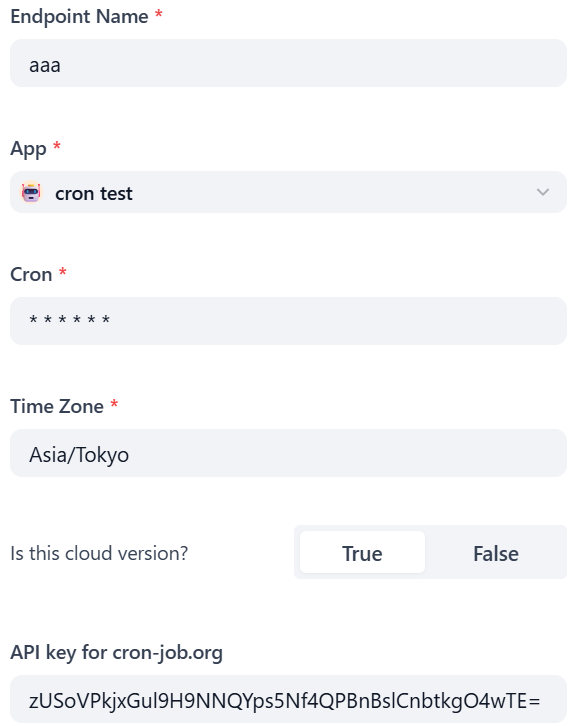
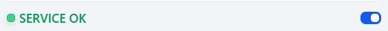

# Cron

**Author:** yt-koike
**Version:** 0.0.1
**Type:** extension

## Description

Cron can automatically trigger workflows at a certain time or frequency.

How to use:

### 1. Install Cron

### 2. Add an endpoint

- Endpoint Name: Custom name of this endpoint. You can input a custom name here.
- Dify Endpoint: Please input the URL of Dify endpoint.
- API key: Please input the API key for a certain workflow.
- Cron: When this plugin will trigger the workflow. Please see the Cron Format section to make a valid setting.

### 3. [Important] Start cron

You need to copy the endpoint URL http://.../e/f3wv4z462ze8sm0n/cron/&lt;command&gt;, replace "&lt;command&gt;" to "status", then access to it.
You will see this message on the page so click "Start?" link ONCE. Do not click it for multiple times. After clicking it once, please reload the page. If the message changed to "Cron status: active", Cron is now on.

### 4. Stop cron

If you want to stop cron, access to the page of the previous section and click "Stop?" link.

## Caution

Endpoint switch(below) will not start or stop cron! Please switch on or off crons via endpoint URLs.

## Cron Format

The order is "seconds minutes hours days months weekdays".
At the moment, only wildcards and lists are supported.
For example, "0,30 * * * * *" will trigger the workflow every thirty seconds, at XX:XX:00 and XX:XX:30 to be more specific.

## Reference

- Cron Logo: https://iconduck.com/icons/154528/cronjob