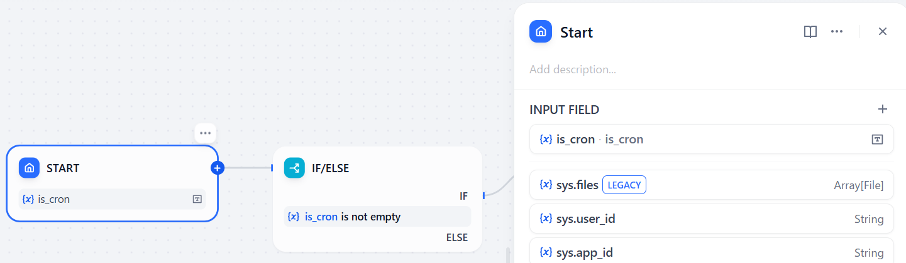

# Cron

**Author:** yt-koike
**Version:** 0.0.1
**Type:** extension

## Description

Cron can automatically trigger workflows at a certain time or frequency.
This plugin does not support cloud version because it has a timeout limit and allows this plugin to work only for a few minutes.
Please use this plugin for self-hosted servers only.

## How to Start and Stop Cron

Here are the instructions how to use this Cron plugin.

### 1. Install Cron

### 2. Add an endpoint

- Endpoint Name: Name of this endpoint. You can input a custom name here.
- App: Workflow or Chatflow to trigger regularly
- Cron: When this plugin will trigger the workflow. Please see the Cron Format section to make a valid setting.

### 3. [Important] Start Cron

You need to access the endpoint URL.
You will see this message on the page so click "Start?" link ONCE. Do not click it for multiple times. After clicking it once, please reload the page. If the message changed to "Cron status: active", Cron is now turned on.

Caution: Endpoint switch(below) will not start or stop Cron! Please switch on or off it via endpoint URLs.

### 4. Stop Cron

If you want to stop Cron, access to the page of the previous section and click "Stop?" link.

## How to Use

After you start Cron, it will automatically trigger workflows.

If you want to know a certain query came from Cron or not, you can use an optional input variable "is_cron".
If Cron made that query, is_cron is set to "yes", otherwise is_cron is empty.
You can make a branch with an if block like the workflow below.

## Required APIs and Credentials 

None. Cron is a standalone plugin.

## Connection requirements

Cron needs a connection without timeout. That's why it doesn't work on https://cloud.dify.ai .

## Cron Format

The order is "seconds minutes hours days months weekdays".
At the moment, only wildcards and lists are supported.
For example, "0,15,30,45 * * * * *" will trigger the workflow every fifteen seconds; at XX:XX:00, XX:XX:15, XX:XX:30 and XX:XX:45 to be more specific.

## Reference

- Repository: https://github.com/yt-koike/dify-cron
- Cron Logo: https://iconduck.com/icons/154528/cronjob
